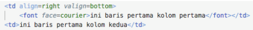
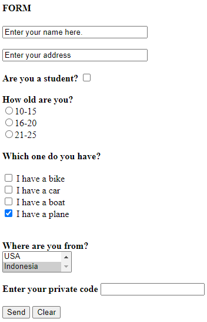

# Jobsheet 1 : Instalasi Web Server dan HTML Dasar

**Nama :** Lavina<br>
**NIM :** 2342760062<br>
**Kelas :** SIB 2D<br>

### **Praktikum Bagian 1. Instalasi Laragon**


- Buka browser Anda, ketikkan localhost kemudian jalankan. <br>
  

### **Praktikum Bagian 2: Memulai HTML**

`hello.html`

```html
<html>
  <head>
    <title>My First HTML Document</title>
  </head>
  <body>
    <p>Hello World! <br />Welcome to my <b>first</b> HTML Page</p>
  </body>
</html>
```

### Hasil Percobaan


- Hilangkan tag `<br>` pada kode, amati perbedaannya dan sampaikan di bawah ini apakah fungsi tag `<br>`
  **Jawab :** Ketika tag `<br>` dihapus maka enter setelah kata `Hello World!` jadi menghilang karena tag tersebut berfungsi untuk menyisipkan satu baris baru.

### **Praktikum Bagian 3: Format Teks**

`heading.html`

```html
<html>
  <body>
    <h1>Heading 1</h1>
    <h2>Heading 2</h2>
    <h3>Heading 3</h3>
    <h4>Heading 4</h4>
    <h5>Heading 5</h5>
    <h6>Heading 6</h6>
  </body>
</html>
```

### Hasil Percobaan


- Tambahkan atribut align di dalam tag heading seperti di bawah ini dan simpan file dengan nama headingAlign.html

`headingAlign.html`

```html
<html>
  <body>
    <h1 align="right">Heading 1</h1>
    <h2 align="left">Heading 2</h2>
    <h3 align="center">Heading 3</h3>
    <h4>Heading 4</h4>
    <h5>Heading 5</h5>
    <h6>Heading 6</h6>
  </body>
</html>
```

### Hasil Percobaan


**Paragraf**
`paragraf.html`

```html
<html>
  <body>
    <p>Ini paragraf pertama</p>
    <p>Ini paragraf kedua kedua kedua kedua kedua kedua kedua kedua kedua</p>
    <p>Ini paragraf ketiga</p>
  </body>
</html>
```

### Hasil Percobaan


`paragrafAlign.html`

```html
<html>
  <head>
    <title>Mengatur Paragraf</title>
  </head>
  <body>
    <p align="right">Ini paragraf pertama</p>
    <p align="center">
      Ini paragraf kedua kedua kedua kedua kedua kedua kedua kedua kedua
    </p>
    <p align="left">Ini paragraf ketiga</p>
  </body>
</html>
```

### Hasil Percobaan


### **Praktikum Bagian 4 : Font**

`font.html`

```html
<html>
  <head>
    <title>Pengaturan Font</title>
  </head>
  <body>
    <b>Menggunakan tag &lt;b&gt;</b><br />
    <strong>Menggunakan tag &lt;strong&gt;</strong><br />
    <i>Menggunakan tag &lt;i&gt;</i><br />
    <em>Menggunakan tag &lt;em&gt;</em><br />
    <u>Menggunakan tag &lt;u&gt;</u><br />
    <strike>Menggunakan tag &lt;strike&gt;</strike>
  </body>
</html>
```

### Hasil Percobaan


### **Praktikum Bagian 5: Karakter Khusus**

`karakter.html`

```html
<html>
  <head>
    <title>Karakter Khusus</title>
  </head>
  <body>
    &pound; Pound <br />
    &euro; Euro <br />
    &copy; Copyright <br />
    &reg; Registered <br />
    &trade; Trademark <br />
  </body>
</html>
```

### Hasil Percobaan


### **Praktikum Bagian 6: Garis Horizontal**

`garishorizontal.html`

```html
<html>
  <head>
    Membuat Garis Horizontal
  </head>
  <body>
    Membuat Garis Horizontal
    <hr />
    Lorem ipsum dolor, sit amet consectetur adipisicing elit. <br />
    Nihil, rerum facilis cum dignissimos iusto omnis minima beatae quae
    consectetur ipsam quaerat natus, commodi officia laboriosam blanditiis
    sapiente, <br />
    dolor in odio eos est. Error adipisci aspernatur necessitatibus quidem iure.
    <br />
    Quibusdam quas maiores <br />
    molestias nam mollitia molestiae, dolorem aliquid debitis perferendis
    cumque? Lorem, ipsum dolor sit amet <br />
    consectetur adipisicing elit. Sint enim corporis, rerum sunt cum, modi
    animi, maiores soluta asperiores <br />
    dolore pariatur quia eaque. Fugiat culpa necessitatibus similique autem ea
    voluptates accusamus! <br />
    Delectus fugit, distinctio, accusantium nobis ex aut tempora nostrum veniam
    a soluta quasi deleniti culpa. <br />
    Veniam voluptatem recusandae similique? Lorem ipsum dolor, sit amet
    consectetur adipisicing elit. <br />
    molestias nam mollitia molestiae, dolorem aliquid debitis perferendis
    cumque? Lorem, ipsum dolor sit amet <br />
    consectetur adipisicing elit. Sint enim corporis, rerum sunt cum, modi
    animi, maiores soluta asperiores <br />
    dolore pariatur quia eaque. Fugiat culpa necessitatibus similique autem ea
    voluptates accusamus! <br />
    Delectus fugit, distinctio, accusantium nobis ex aut tempora nostrum veniam
    a soluta quasi deleniti culpa. <br />
    Veniam voluptatem recusandae similique?
  </body>
</html>
```

### Hasil Percobaan


### **Praktikum Bagian 7: Menggunakan List**

`list.html`

```html
<html>
  <head>
    <title>Bekerja dengan List</title>
  </head>
  <body>
    Ordered List
    <ol>
      <li>Satu</li>
      <li>Dua</li>
      <li>Tiga</li>
    </ol>
    <br />
    <hr />
    Unordered List
    <ul>
      <li>Satu</li>
      <li>Dua</li>
      <li>Tiga</li>
    </ul>
    <br />
    <hr />
    Definition List
    <dl>
      <dt>Satu</dt>
      <dd>Satu satu</dd>
      <dd>Satu dua</dd>
      <dt>Dua</dt>
      <dd>Dua dua</dd>
    </dl>
  </body>
</html>
```

### Hasil Percobaan


### **Praktikum Bagian 8 : Pewarnaan**

`warna.html`

```html
<html>
  <head>
    <title>Pewarnaan</title>
  </head>
  <body bgcolor="aqua">
    <h3 align="center">Heading 3</h3>
    <font color="red">Font berwarna merah</font> <br />
    <font color="#FF0000">Font berwarna merah (menggunakan nilai heksa)</font>
  </body>
</html>
```

### Hasil Percobaan


### **Praktikum Bagian 9: Bekerja dengan Gambar**

`gambar.html`

```html
<html>
  <head>
    <title>Bekerja dengan gambar</title>
  </head>
  <body>
    <p>
      
      Lorem ipsum dolor sit amet consectetur adipisicing elit. Aperiam, debitis
      corporis. Reiciendis dolore id, corrupti distinctio repellendus nam iusto
      voluptatem.
      <br>
      <hr>
    </p>
    <p>
      
      Lorem ipsum dolor sit amet, consectetur adipisicing elit. Possimus distinctio minus cumque. Illum doloribus eaque veniam odio, nobis quo nam.
    </p>
  </body>
</html>
```

### Hasil Percobaan


### **Praktikum Bagian 10 : Link**

`macamLink.html`

```html
<html>
  <title>Membuat Link</title>
  <head> </head>
  <body>
    <a name="TOP">
      <h4>Macam-macam Link</h4>
      <a href="#Link Relatif">Link Relatif</a
      ><a href="#Link Absolut">Link Absolut</a
      ><a href="Link with New Window">Link with New Window</a
      ><a href="Link ke email">Link ke Email</a>
    </a>
    <br /><br /><br /><br /><br /><br /><br /><br /><br /><br /><br /><br /><br /><br /><br /><br /><br /><br /><br /><br /><br /><br /><br /><br /><br /><br /><br /><br /><br /><br /><br /><br /><br /><br /><br /><br /><br /><br /><br /><br /><br /><br /><br /><br /><br /><br /><br /><br /><br /><br /><br /><br /><br /><br /><br /><br /><br /><br /><br /><br /><br /><br /><br /><br /><br /><br /><br /><br /><br /><br />
    <a name="Link Relatif">
      <h1>Ini adalah contoh Link</h1>
      <p>
        Klik <a href="gambar.html">disini</a> Jika Anda ingin menuju ke halaman
        berikutnya. <br /><br />
        Lorem ipsum dolor sit amet consectetur adipisicing elit. Fuga at nemo
        eius tempora, id consequatur ipsum voluptatibus nam dolorum assumenda
        fugit sint beatae sit magnam pariatur autem cupiditate porro illo.
        Excepturi illum expedita delectus, nostrum consectetur ducimus sunt
        dicta nulla nesciunt fuga. Eveniet dignissimos omnis distinctio?
        Voluptates, repudiandae id. Non dolores quia pariatur quidem consequatur
        accusamus facilis, aliquam hic obcaecati quaerat, eligendi nostrum
        voluptatem delectus ex explicabo necessitatibus, maiores nobis
        perferendis ducimus! Ducimus tempora dolorem aliquid obcaecati minus
        adipisci architecto. Exercitationem quidem quos perspiciatis suscipit
        rerum qui optio consequatur quam, animi inventore sed alias beatae nihil
        vitae debitis adipisci neque!<br /><br /><br /><br /><br />
        <br /><br /><br /><br /><br />
        <a href="#TOP">Kembali Ke Menu</a>
      </p> </a
    ><br /><br />
    <a name="Link Absolut">
      <h1>Ini adalah contoh Link Absolut</h1>
      <p>
        Klik <a href="http://www.goole.com">disini</a> untuk pencarian yang anda
        inginkan.<br /><br />
        Lorem ipsum dolor sit amet consectetur adipisicing elit. Atque quae,
        suscipit autem quos illum nihil ad reprehenderit consequatur similique
        officia in ea iste rerum dolor expedita alias voluptate accusamus
        distinctio harum? Hic sunt aperiam nemo, esse obcaecati commodi, aut
        illo pariatur ipsum eligendi corrupti unde nam temporibus expedita modi
        maiores laboriosam quae est ducimus incidunt tempora dignissimos a
        accusamus! Nemo quaerat eveniet labore mollitia quibusdam consequuntur
        laudantium, fuga officia sint, nostrum eligendi nobis blanditiis, maxime
        tenetur ratione nisi! Libero omnis sunt mollitia ab, eveniet facere
        culpa blanditiis reiciendis voluptatibus a porro quod labore laborum,
        unde obcaecati minima nisi iure. Commodi. <br /><br /><br /><br /><br />
        <br /><br /><br /><br /><br />
        <a href="#TOP">Kembali Ke Menu</a>
      </p>
    </a>
    <br /><br />
    <a name="Link with New Window">
      <h1>Ini adalah contoh link dengan window baru</h1>
      <p>
        Buka <a href="http://www.goole.com" target="_blank">www.goole.com</a> di
        halaman baru. <br /><br />
        Lorem ipsum dolor sit amet consectetur adipisicing elit. Voluptas
        molestiae vero itaque accusamus eligendi deserunt doloremque quos saepe
        vel, harum maxime culpa, labore nisi ea unde ipsum excepturi numquam
        dolor voluptatibus ullam. Eaque porro ipsam dolorem officiis repellendus
        sunt architecto sed unde possimus alias ipsa ducimus, suscipit quae
        natus blanditiis, delectus ut earum. Deleniti ad dicta ex officia
        accusamus hic exercitationem repudiandae aliquid consectetur tempora
        corporis quos labore, doloremque aliquam asperiores, voluptatibus
        dolores odit quasi impedit voluptates tenetur inventore. Eos dolorem
        porro vero sunt sapiente ad ipsam architecto perspiciatis aspernatur
        fuga accusamus recusandae nobis, voluptate et optio? Mollitia,
        asperiores tenetur?<br /><br /><br /><br /><br />
        <br />
        <a href="#TOP">Kembali Ke Menu</a><br /><br /><br /><br /><br /><br />
      </p>
    </a>
    <a name="Link ke Email">
      <h1>Ini adalah contoh link ke email</h1>
      <p>
        Anda bisa menghubungi saya di
        <a href="mailto:lavina8000@gmail.com">email ini</a> untuk pertanyaan
        lebih lanjut. <br /><br />
        Lorem, ipsum dolor sit amet consectetur adipisicing elit. Consequuntur
        tempore error eum possimus, eos doloremque minima architecto neque ipsum
        placeat unde nesciunt perspiciatis blanditiis quam excepturi. Est
        excepturi quam doloribus illo earum dolorum rem, quo quibusdam sed nobis
        perspiciatis quod amet veniam cumque consectetur omnis ipsa. Deleniti
        qui accusamus quasi ratione, adipisci ea dicta cum est nobis vero
        facilis saepe repudiandae vitae ipsa, necessitatibus, mollitia quis.
        Labore reiciendis blanditiis veniam dolore consequuntur consequatur.
        Blanditiis, voluptatum perferendis incidunt qui tempora minus molestiae
        aliquid aperiam rerum veritatis explicabo alias harum totam mollitia
        obcaecati accusantium minima deserunt eaque sequi vel accusamus soluta!
        Fugiat!
      </p>
    </a>
    <br /><br />
    <a href="#TOP">Kembali Ke Atas</a>
  </body>
</html>
```

### Hasil Percobaan


### Tugas Praktikum Bagian 10 : Link

Buat sebuah halaman, beri nama tugasLink.html Tampilkan sebuah gambar yang mengandung link ke http://www.google.com.

`tugasLink.html`

```html
<html>
  <head>
    <title>Link Google</title>
  </head>
  <body>
    <h1>Klik gambar untuk membuka google</h1>
    <a href="https://www.google.com/">
      
    </a>
  </body>
</html>
```

### Hasil Percobaan


### **Praktikum Bagian 11 : Tabel dan Pengaturannya**

`buatTabel.html`

```html
<html>
  <head>
    <title>Membuat Tabel</title>
  </head>
  <body>
    <table>
      <tr>
        <td>Ini baris pertama kolom pertama</td>
        <td>Ini baris pertama kolom kedua</td>
      </tr>
    </table>
  </body>
</html>
```

### Hasil Percobaan


Tambahkan atribut border = 1 pada tag `<table>`. Simpan file lalu jalankan melalui browser : localhost/dasarWeb/buatTabel.html <br>

Hasilnya: <br>


Tambahkan satu baris dalam tabel yang dibuat sebelumnya dan tambahkan satu kolom di dalamnya. <br>

Hasilnya:<br>


Dari kode yang anda ubah di soal no 17, tambahkan atribut pada tag `<table>` berupa height=100% width=40%. <br>

Hasilnya:<br>


Dari kode program yang anda ubah di langkah 12, hapus tanda % pada height dan width, sehingga menjadi height=100 width=40. <br>

Hasilnya: <br>


Dari kode program yang anda ubah pada langkah 15, tambahkan atribut cellpadding = 20. <br>

Hasilnya: <br>


Dari kode program yang anda ubah pada langkah 18, tambahkan atribut cellspacing=5. <br>

Hasilnya:<br>


Dari kode program yang anda ubah pada langkah 21, pada kode program yang digunakan untuk mengatur kolom 1 dari baris 1, tambahkan atribut align=right, sehingga kode pada bagian tersebut menjadi `<td align=right>`. <br>

Hasilnya:<br>


Dari kode program yang anda ubah pada langkah 24, tambahkan % pada height dan width, sehingga menjadi height=100% dan width=40% <br>
Selanjutnya pada kode program yang digunakan untuk mengatur kolom 1 dari baris 1, tambahkan atribut valign=bottom, sehingga kode pada bagian tersebut menjadi `<td align=right valign=bottom>` <br>

Hasilnya:<br>


Dari kode program pada langkah 28, tambahkan pengaturan font pada isi baris pertama kolom pertama dengan menambahkan tag `<font>` di dalam tag `<td>`. Dapat dilihat di langkah 32. <br>
 <br>

Hasilnya:<br>


Ubah warna tulisan “ini baris pertama kolom pertama” menjadi warna merah, ukuran=15. <br>

Hasilnya:<br>


Dari kode program buatTabel.html setelah langkah 35 selesai, tambahkan atribut colspan=”2” pada baris kedua kolom 1, sehingga pada tag `<table>` hasilnya akan seperti pada potongan kode program di langkah 37. <br>

Hasilnya: <br>


Kemudian tambahkan 1 kolom lagi di baris kedua. <br>

Hasilnya: <br>


Tambahkan rowspan=”2” pada baris pertama kolom pertama <br>

Hasilnya: <br>


### **Praktikum Bagian 12 : Bekerja dengan Form pada HTML**

`buatForm.html`

```html
<html>
  <head>
    <title>Membuat Form</title>
  </head>
  <body>
    <form action="gambar.html" method="post">
      <h4>FORM</h4>
      <input type="text" name="var1" size="30" value="Enter your name here." />
      <br /><br />
      <b>Are you a student?</b>
      <input type="checkbox" name="var3" />
      <br /><br />
      <b>How old are you?</b> <br />
      <input type="radio" name="var4" value="r1" />10-15 <br />
      <input type="radio" name="var4" value="r2" />16-20 <br />
      <input type="radio" name="var4" value="r3" />21-25 <br />
      <br />
      <input type="submit" name="var5" value="Send" />
      <input type="reset" name="var6" value="Clear" />
    </form>
  </body>
</html>
```

### Hasil Percobaan


Tambahkan satu input text yang akan digunakan untuk memasukkan alamat, letakkan di bawah elemen input text untuk memasukkan nama. <br>
Hasilnya: <br>


Tambahkan kode program berikut ini di bawah radio button yang terakhir, di atas tombol submit dan clear. <br>
 <br>

Hasilnya: <br>


Dari kode yang anda ubah di soal no 32, tambahkan satu input checkbox yang akan menampilkan pilihan berisi “I have a plane” dan tanda ✓ pindah dari opsi “I have a bike ke opsi chexbox “I have a plane. <br>

Hasilnya:<br>


Tambahkan kode program di langkah ke 17 ke dalam kode program yang anda ubah di langkah 13, tempatkan di bawah pengaturan checkbox dan di atas pengaturan tombol. <br>
<br>

Hasilnya:<br>


Dari kode program yang anda ubah pada langkah 17,tambahkan satu pilihan negara yaitu Indonesia dan default pilihan berada di negara Indonesia. <br>

Hasilnya:<br>


Dari kode program pada langkah 17, ubah nilai size=1 menjadi size=2. <br>

Hasilnya:<br>


Dari kode program yang anda ubah pada langkah 24, tambahkan sebuah single text area untuk memasukkan password, menggunakan input dengan tipe password. <br>

Hasilnya:<br>


Tambahkan sebuah text area untuk mengetik komentar panjang dengan menggunakan tag `<textarea>` dan `</textarea>` <br>

Hasilnya: <br>


Perhatikan pada tag `<form>` terdapat atribut method=”POST”. Jalankan kembali pada browser alamat berikut : localhost/dasarWeb/buatForm.html,isi form, lalu klik pada tombol Send. Perhatikan pada alamat URL di halaman yang di tuju setelah tombol Send diklik. <br>
Buka kembali kode program buatForm.html, ubah method dari POST menjadi GET. Simpan dan jalankan kembali pada browser alamat berikut : localhost/dasarWeb/buatForm.html,isi form, lalu klik pada tombol Send. Perhatikan pada alamat URL di halaman yang di tuju setelah tombol send diklik. Amati dan bandingkan perbedaan antara method GET dan POST.

#### Hasil method POST

 <br>
Ketika menggunakan method POST url linknya hanya menampilkan nama file atau nama page yang diletakkan di atribut action.

#### Hasil method GET

 <br>
Sedangkan jika menggunakan method GET url linknya berisi value-value dari form yang sudah diisi.
