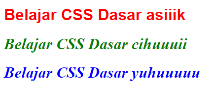
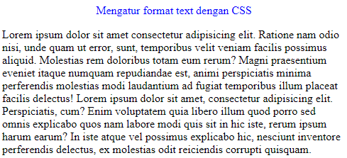
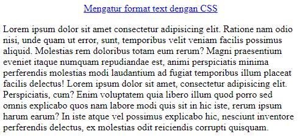

# Jobsheet 2 : CSS

**Nama :** Lavina<br>
**NIM :** 2342760062<br>
**Kelas :** SIB 2D<br>

### **Praktikum Bagian 1. Menghubungkan HTML dengan CSS**

`index.html`

```html
<html>
  <head>
    <title>Main Page</title>
    <link rel="stylesheet" type="text/css" href="style.css" />
  </head>
  <body>
    <h2>Welcome To DasarWeb</h2>
  </body>
</html>
```

`style.css`

```css
h2 {
  color: orange;
  font-family: Trebuchet MS;
  text-align: center;
}
```

### Hasil Percobaan

<br>

### **Praktikum Bagian 2: Penggunaan div**

`div.html`

```html
<html>
  <body>
    <p>Ini adalah beberapa teks.</p>

    <div style="background-color: lightblue">
      <h3>Ini adalah sebuah heading di dalam elemen div</h3>
      <p>Ini adalah teks di dalam div.</p>
    </div>
  </body>
</html>
```

### Hasil Percobaan

<br>

**Penjelasan:** Tag `<div>` berfungsi untuk mendefinisikan divisi atau bagian dalam dokumen HTML. Tag `<div>` juga digunakan sebagai wadah untuk elemen HTML yang kemudian dapat diberi styling. Karena itu semua elemen yang ada di dalam tag tersebut mendapatkan gaya yang sama dari CSS yang sudah dibuat.

### **Praktikum Bagian 3: Mengenal class dan id pada HTML**

`index.html`

```html
<html>
  <head>
    <title>Main Page</title>
    <link rel="stylesheet" type="text/css" href="style.css" />
  </head>
  <body>
    <h2>Welcome To DasarWeb</h2>
    <br /><br />
    <div class="kotak">kotak 1</div>
    <div class="kotak">kotak 2</div>
    <div class="kotak">kotak 3</div>

    <div id="kotak">Kotak 4</div>
  </body>
</html>
```

`style.css`

```css
h2 {
  color: orange;
  font-family: Trebuchet MS;
  text-align: center;
}

.kotak {
  padding: 50px;
  width: 100px;
  color: #fff;
  margin: 10px;
  background: orange;
}

#kotak {
  width: 400px;
  color: #fff;
  background: blue;
  padding: 50px;
}
```

### Hasil Percobaan

<br>

**Penjelasan:** Atribut `class` bisa digunakan oleh lebih dari satu elemen html sedangkan `id` bersifat unik untuk satu elemen html saja. Pada CSS selektor `class` menggunakan tanda titik `.` sedangkan selektor `id` menggunakan tanda pagar `#`.

### **Praktikum Bagian 4 : Mengubah Background Halaman Web dengan CSS**

`style.css`

```css
body {
  background-color: lightcyan;
  color: white;
}
```

### Hasil Percobaan

<br>

**Penjelasan:** Di CSS bisa langsung melakukan styling pada tag `body` tanpa atribut `class` dan `id`.

### **Praktikum Bagian 5: Menggunakan image untuk Background**

`style.css`

```css
body {
  background-image: url("lonely-fish.jpg");
  color: white;
}
```

### Hasil Percobaan

<br>

**Penjelasan:** Sintaks yang ditambahkan sebelumnya di `body` memberikan background berupa gambar.

`style.css`

```css
body {
  background-image: url("img/lonely-fish.png"), url("img/lonely-fish.png");
  background-repeat: no-repeat, repeat;
  color: white;
}
```

### Hasil Percobaan

<br>
**Penjelasan:** Gambar yang pertama diberi properti `no-repeat` sehingga hanya muncul 1x sedangkan gambar yang kedua diberi properti `repeat` sehingga gambarnya ditampilkan lebih dari 1 sesuai dengan panjang layar.

### **Praktikum Bagian 6: Margin dan Padding pada CSS**

`index.html`

```html
<!DOCTYPE html>
<html lang="en">
  <head>
    <title>Margin CSS</title>
    <link rel="stylesheet" type="text/css" href="styleMargin.css" />
  </head>
  <body>
    <div class="box">
      <h1>Ini adalah box</h1>
    </div>
    <div class="box-dua">
      <h1>Ini adalah box dua</h1>
    </div>
  </body>
</html>
```

`styleMargin.css`

```css
h1 {
  color: pink;
}

.box {
  background-color: black;
  height: 200px;
  width: 300px;
  margin: 30px;
}

.box-dua {
  background-color: black;
  height: 100px;
  width: 200px;
  margin-left: 500px;
}
```

### Hasil Percobaan

<br>

**Penjelasan:** Properti `margin` memberikan jarak atas bawah kanan kiri pada class box sedangkan pada class box-dua hanya diberi properti `margin-left` sehingga hanya ada jarak pada bagian kiri.

`styleMargin.css`

```css
.box {
  background-color: black;
  height: 200px;
  width: 300px;
  margin: 300px;
}
```

### Hasil Percobaan

<br>

**Penjelasan:** Jarak atas bawah kanan kiri dari class box menjadi 300 pixel.

`index.html`

```html
<!DOCTYPE html>
<html lang="en">
  <head>
    <title>Padding CSS</title>
    <link rel="stylesheet" type="text/css" href="stylePadding.css" />
  </head>
  <body>
    <h2>Belajar Padding dengan CSS</h2>
    <div class="box">
      <h1>Ini adalah box</h1>
    </div>
    <div class="box-dua">
      <h1>Ini adalah box dua</h1>
    </div>
  </body>
</html>
```

`stylePadding.css`

```css
h1 {
  text-align: center;
  color: cornsilk;
}

h2 {
  text-align: center;
}

.box {
  background-color: blue;
  height: 200px;
  width: 300px;
  padding: 20px;
}

.box-dua {
  background-color: red;
  height: 100px;
  width: 600px;
  padding-left: 70px;
}
```

### Hasil Percobaan

<br>
**Penjelasan:** Properti `padding` memberikan space antar konten yang ada didalam sebuah elemen.

`stylePadding.css`

```css
.box {
  background-color: blue;
  height: 200px;
  width: 300px;
  padding: 200px;
}
```

### Hasil Percobaan

<br>

**Penjelasan:** Pada percobaan tersebut `padding` pada class box diubah paddingnya menjadi `200px`.

### **Praktikum Bagian 7 : Pengaturan Font pada CSS**

`index.html`

```html
<!DOCTYPE html>
<html>
  <head>
    <title>Font CSS</title>
    <link rel="stylesheet" type="text/css" href="styleFont.css" />
  </head>
  <body>
    <h1 class="tulisan_satu">Belajar CSS Dasar asiiik</h1>
    <h1 class="tulisan_dua">Belajar CSS Dasar cihuuuii</h1>
    <h1 class="tulisan_tiga">Belajar CSS Dasar yuhuuuuu</h1>
  </body>
</html>
```

`styleFont.css`

```css
.tulisan_satu {
  color: red;
  font-family: sans-serif;
  font-style: normal;
}

.tulisan_dua {
  color: green;
  font-size: 24pt;
  font-style: italic;
}

.tulisan_tiga {
  color: blue;
  font-weight: bold;
  font-style: oblique;
}
```

### Hasil Percobaan

<br>
**Penjelasan:** Styling yang diberikan mengubah warna, jenis font dan font stylenya.

### **Praktikum Bagian 8: Mengatur Hyperlink dengan CSS**

`index.html`

```html
<!DOCTYPE html>
<html>
  <head>
    <title>Hyperlink CSS</title>
    <link rel="stylesheet" type="text/css" href="styleLink.css" />
  </head>
  <body>
    <a class="link" href="http://www.polinema.ac.id" target="_blank"
      >Klik di sini</a
    >
  </body>
</html>
```

`styleLink.css`

```css
.link {
  font-size: 20pt;
}

.link:hover {
  color: red;
}

.link:link {
  color: blue;
}
```

### Hasil Percobaan

<br>
**Penjelasan:** Link tersebut diberi selektor `hover` dimana saat mouse mengarah ke linknya akan berubah warna jadi merah, sedangkan selektor `link` berarti link dalam kondisi normal diberi warna biru.

### **Praktikum Bagian 9 : Mengatur Format Text dengan CSS**

`index.html`

```html
<html>
  <head>
    <title>format text CSS</title>
    <link rel="stylesheet" href="styleText.css" />
  </head>
  <body>
    <p class="tulisan_warna">Mengatur format text dengan CSS</p>
    <p class="par1">
      Lorem ipsum dolor sit amet consectetur adipisicing elit. Ratione nam odio
      nisi, unde quam ut error, sunt, temporibus velit veniam facilis possimus
      aliquid. Molestias rem doloribus totam eum rerum? Magni praesentium
      eveniet itaque numquam repudiandae est, animi perspiciatis minima
      perferendis molestias modi laudantium ad fugiat temporibus illum placeat
      facilis delectus! Lorem ipsum dolor sit amet, consectetur adipisicing
      elit. Perspiciatis, cum? Enim voluptatem quia libero illum quod porro sed
      omnis explicabo quos nam labore modi quis sit in hic iste, rerum ipsum
      harum earum? In iste atque vel possimus explicabo hic, nesciunt inventore
      perferendis delectus, ex molestias odit reiciendis corrupti quisquam.
    </p>
  </body>
</html>
```

`styleText.css`

```css
.tulisan_warna {
  color: blue;
}
```

### Hasil Percobaan

<br>
**Penjelasan:** Style diatas berfungsi untuk merubah warna pada teks dengan menggunakan properti `color`.

`styleText.css`

```css
.tulisan_warna {
  color: blue;
  text-align: center;
}
```

### Hasil Percobaan

<br>
**Penjelasan:** Style diatas berfungsi untuk membuat teksnya berada di tengah.

`styleText.css`

```css
.tulisan_warna {
  color: blue;
  text-align: center;
  text-decoration: underline;
}
```

### Hasil Percobaan

<br>
**Penjelasan:** Untuk memberi garis bawah menggunakan properti `text-decoration` dengan value `underline`.

`styleText.css`

```css
.tulisan_warna {
  color: blue;
  text-align: center;
  text-decoration: underline;
}

p {
  letter-spacing: 5px;
}
```

### Hasil Percobaan

<br>
**Penjelasan:** Untuk memberi jarak antar kata pada paragraf menggunakan properti `letter-spacing`.

### **Praktikum Bagian 10 : Mengenal Position CSS**

`index.html`

```html
<html>
  <head>
    <title>Position CSS</title>
    <link rel="stylesheet" href="stylePosition.css" />
  </head>
  <body>
    <h2>position: static;</h2>
    <p>
      Position static digunakan untuk mengatu element menjadi statis secara
      default. Elemen akan mengikuti posisi nomal secara default. element tidak
      dipengaruhi oleh poperrti sepeti top, bottom, left dan right.;
    </p>
    <div class="static">Elemen in idiaturr menggunakan posisi: static;</div>
    <br /><br /><br /><br />
    <h2>position: relative;</h2>
    <p>
      Sebuah element HTML yang menggunakan position elative akan terletak pada
      posisi normal. Mengatur properti atas, kanan, bawah, dan kiri dari elemen
      yang diposisikan dengan "relatif" akan membuatnya jauh dari posisi
      normalnya. Konten lain tidak akan disesuaikan agar sesuai dengan celah
      yang ditinggalkan oleh elemen tersebut.
    </p>
    <div class="relative">Elemen ini diatur menggunakan posisi: relative;</div>
    <br /><br /><br />
    <h2>position: fixed;</h2>
    <p>
      Sebuah element HTML yang di setting dengan position fixed akan memiliki
      sifat tetap, tanpa ada perubahan bahkan jika halaman website di scroll.
      Berlaku pengaturan left, bottom, top dan right pada position fixed;
    </p>
    <div class="fixed">Elemen in diatur menggunakan posisi: fixed;</div>
    <br /><br /><br />
    <br /><br /><br />
    <br /><br /><br />
    <br /><br /><br />
    <br /><br /><br />
    <h2>position: absolute;</h2>
    <p>
      Element HTML yang menggunakan position absolute akan diposisikan relatif
      dengan elemen lain yang mendahuluinya yang terdekat, bukan relatif
      terhadap layar secara normal.;
    </p>
    <div class="relative1">
      Elemen ini diatu menggunakan posisi: relative;
      <div class="absolute">Elemen ini diatu menggunakan posisi: absolute;</div>
    </div>
    <br /><br /><br />
    <br /><br /><br />
    <br /><br /><br />
    <h2>position: sticky;</h2>
    <p>
      Cobalah untuk <b>scroll</b> untuk mengetahui bagaimana posisi sticky
      bekerja.
    </p>
    <p>Catatan: IE/Edge 15 dan versi yang lebih lama tidak mendukung sticky.</p>

    <div class="sticky">Hola Aku adalah sticky!</div>
    <div style="padding-bottom: 2000px">
      <p>
        Dalam contoh ini, elemen sticky menempel pada posisi paling atas halaman
        (top:0), ketika mencapai posisi scrollnya.
      </p>
      <p>Cobalah untuk melakukan scrollnya.</p>
      <p>
        Cobalah untuk melakukan scroll.. Lorem ipsum dolor sit amet, consectetur
        adipisicing elit. Autem quae officia exercitationem iusto libero ipsam,
        sunt laboriosam cum animi quisquam, aliquid ab ex, amet natus fuga
        recusandae! Dolore itaque fuga magni minima beatae quae nobis ullam
        aliquam voluptas, nemo eaque temporibus aspernatur rerum dolorem
        similique quibusdam deleniti nam molestias! Itaque!
      </p>
      <p>
        Cobalah untuk melakukan scroll.. Lorem ipsum dolor sit amet, consectetur
        adipisicing elit. Autem quae officia exercitationem iusto libero ipsam,
        sunt laboriosam cum animi quisquam, aliquid ab ex, amet natus fuga
        recusandae! Dolore itaque fuga magni minima beatae quae nobis ullam
        aliquam voluptas, nemo eaque temporibus aspernatur rerum dolorem
        similique quibusdam deleniti nam molestias! Itaque!
      </p>
    </div>
  </body>
</html>
```

`stylePosition.css`

```css
div.static {
  position: static;
  border: 3px solid #73ad21;
}

div.relative {
  position: relative;
  left: 30px;
  border: 3px solid #73ad21;
}

div.fixed {
  position: fixed;
  bottom: 0;
  right: 0;
  width: 300px;
  border: 3px solid #73ad21;
}

div.relative1 {
  position: relative;
  width: 400px;
  height: 200px;
  border: 3px solid #73ad21;
}

div.absolute {
  position: absolute;
  top: 80px;
  right: 0;
  width: 200px;
  height: 100px;
  border: 3px solid #73ad21;
}

div.sticky {
  position: -webkit-sticky;
  position: sticky;
  top: 0;
  background-color: yellow;
  border: 2px solid #4caf50;
}
```

### Hasil Percobaan

<br>
<br>
<br>
<br>

### Praktikum Bagian 11 : Menggunakan Float

`index.html`

```html
<html>
    <head>
        <title>Menggunakan Float</title>
        <link rel="stylesheet" href="styleFloat.css">
    </head>
    <body>
        <h2>Float Kiri<h2><br>
        <div class="float1">
            <p>
                Lorem Ipsum is simply dummy text of the printing and typesetting industry.
                Lorem Ipsum has been the industry's standard dummy text ever since the 1500s,
                When an unknown printer took a galley of type and scrambled it to make a type specimen book.
                
                It has survived not only five centuries, but also the leap into electronic typesetting,
                remaining essentially unchanged. It was popularised in the 1960s with the release of Letraset
                sheets containing Lorem Ipsum passages, and more recently with desktop publishing software
                like Aldus PageMaker including versions of Lorem Ipsum.
                Lorem Ipsum is simply dummy text of the printing and typesetting industry.
                Lorem Ipsum has been the industry's standard dummy text ever since the 1500s,
                when an unknown printer took a galley of type and scrambled it to make a type specimen book.
                It has survived not only five centuries, but also the leap into electronic typesetting,
                remaining essentially unchanged. It was popularised in the 1960s with the release of Letraset
                sheets containing Lorem Ipsum passages, and more recently with desktop publishing software
                like Aldus PageMaker including versions of Lorem Ipsum.
                Lorem Ipsum is simply dummy text of the printing and typesetting industry.
                Lorem Ipsum has been the industry's standard dummy text ever since the 1500s,
                when an unknown printer took a galley of type and scrambled it to make a type specimen book.
                It has survived not only five centuries, but also the leap into electronic typesetting,
                remaining essentially unchanged. It was popularised in the 1960s with the release of Letraset
                sheets containing Lorem Ipsum passages, and more recently with desktop publishing software
                like Aldus PageMaker including versions of Lorem Ipsum.
            </p>
        </div>
    </body>
</html>
```

`styleFloat.css`

```css
h2 {
  text-align: center;
  color: blueviolet;
}

.gambar {
  width: 100px;
  float: left;
  margin-right: 10px;
}
```

### Hasil Percobaan

<br>
**Penjelasan:** `float` adalah properti yang mengatur apakah elemen melayang entah ke kiri, ke kanan atau tidak melayang.

### **Praktikum Bagian 12 : CSS Layouting**

`index.html`

```html
<!DOCTYPE html>
<html>
  <head>
    <title>CSS Layouting</title>
  </head>
  <body>
    <h1>Selamat Datang Di Website Kami</h1>
    <h2>Daftar Link</h2>
    <a href="#">Link 1</a>
    <a href="#">Link 2</a>
    <a href="#">Link 3</a>
    <a href="#">Link 4</a>
    <h2>TEKNIK INFORMATIKA</h2>
    
    <p>
      Pada tahun 2010 berdasar kebutuhan masyarakat dan industri terkait Program
      Diploma IV bidang informatika maka Polinema mendirikan program studi baru
      Diploma IV (DIV) Teknik Informatika (TI). Pada awal berdirinya jumlah
      peserta didik Program D-IV TI hanya terdiri dari 46 Mahasiswa, namun pada
      tahun 2015 jumlah peserta didik Prodi D-IV TI telah mengalami peningkatan
      menjadi 545 Mahasiswa.
    </p>
    <p>
      Perkembangan jumlah mahasiswa yang sangat pesat baik di Program Studi
      D-III MI maupun D-IV TI mendorong pimpinan di Polinema untuk menyatukan
      kedua program studi tersebut dalam satu organisasi jurusan baru terpisah
      dari jurusan Teknik Elektro. dibawa Jurusan baru terpisah dari Jurusan
      Teknik Elektro. Dan pada tahun 2015 berdasarkan SK Direktur Nomor 53 dalam
      rangka peningkatan mutu pengelolaan dan optimasi sumber daya dibentuklah
      Jurusan Teknologi Informasi (JTI) dengan prodi D-III MI dan D-IV TI.
    </p>
    <p class="copyright">
      Copyright 2020. Desain dan Pemrograman Web JTI Polinema
    </p>
  </body>
</html>
```

### Hasil Percobaan

<br>

Berikan tag `<div>` <br>
`index.html`

```html
<!DOCTYPE html>
<html>
  <head>
    <title>CSS Layouting</title>
  </head>
  <body>
    <div class="header">
      <h1>Selamat Datang Di Website Kami</h1>
    </div>

    <div class="navigasi">
      <h2>Daftar Link</h2>
      <a href="#">Link 1</a>
      <a href="#">Link 2</a>
      <a href="#">Link 3</a>
      <a href="#">Link 4</a>
    </div>

    <div class="main">
      <h2>TEKNIK INFORMATIKA</h2>
      
      <p>
        Pada tahun 2010 berdasarkan kebutuhan masyarakat dan industri terkait
        Program Diploma IV bidang informatika maka Polinema mendirikan program
        studi baru Diploma IV (DIV) Teknik Informatika (TI). Pada awal
        berdirinya jumlah peserta didik Program D-IV TI hanya terdiri dari 46
        Mahasiswa, namun pada tahun 2015 jumlah peserta didik Prodi D-IV TI
        telah mengalami peningkatan menjadi 545 Mahasiswa.
      </p>
      <p>
        Perkembangan jumlah mahasiswa yang sangat pesat baik di Program Studi
        D-III MI maupun D-IV TI mendorong pimpinan di Polinema untuk menyatukan
        kedua program studi tersebut dalam satu organisasi jurusan baru terpisah
        dari jurusan Teknik Elektro, dibawa Jurusan baru terpisah dari Jurusan
        Teknik Elektro. Dan pada tahun 2015 berdasarkan SK Direktur Nomor 53
        dalam rangka peningkatan mutu pengelolaan dan optimasi sumber daya
        dibentuklah Jurusan Teknologi Informasi (ITI) dengan prodi D-III MI dan
        D-IV TI.
      </p>
    </div>

    <div class="copyright">
      <p>Copyright 2020. Desain dan Pemrograman Web JTI Polinema</p>
    </div>
  </body>
</html>
```

### Hasil Percobaan

<br>
**Penjelasan:** Belum tampak perbedaan dari yang sebelumnya karena belum diberi styling.

`index.html`

```html
<head>
  <title>CSS Layouting</title>
  <style>
    .navigasi {
      background-color: pink;
    }
    .main {
      background-color: lightgreen;
    }
  </style>
</head>
```

### Hasil Percobaan

<br>
**Penjelasan:** Elemen-elemen dari tiap div memiliki style yang berbeda sesuai dengan classnya.

### **Praktikum Bagian 13 : Display Inline**

`index.html`

```html
<head>
  <title>CSS Layouting</title>
</head>
<body>
  <div class="header">
    <h1>Selamat Datang Di Website Kami</h1>
  </div>

  <div class="navigasi">
    <h2>Daftar Link</h2>
    <a href="#">Link 1</a>
    <a href="#">Link 2</a>
    <a href="#">Link 3</a>
    <a href="#">Link 4</a>
    <a href="#">Link 5</a>
  </div>
</body>
```

### Hasil Percobaan

<br>

**Penjelasan:** Stylenya kembali menjadi seperti semula atau tampilannya sesuai dengan default.

### **Praktikum Bagian 14 : Display inline-block**

`index.html`

```html
<head>
  <title>CSS Layouting</title>
  <style>
    a {
      background-color: pink;
      width: 200px;
      height: 200px;
      display: inline-block;
    }
  </style>
</head>
```

### Hasil Percobaan

<br>

**Penjelasan:** Menampilkan elemen secara sebaris dan bisa menerapkan tinggi dan lebarnya sesuai keinginan.

### **Praktikum Bagian 15 : Display block**

`index.html`

```html
<head>
  <title>CSS Layouting</title>
  <style>
    a {
      background-color: pink;
    }
    h1,
    h2,
    p {
      background-color: lightgreen;
    }
  </style>
</head>
```

### Hasil Percobaan

<br>

**Penjelasan:** Ketika browsernya diresize teksnya menjadi menyesuaikan ukuran dari browsernya terlihat lebih responsif.

`index.html`

```html
<head>
  <title>CSS Layouting</title>
  <style>
    a {
      background-color: pink;
    }
    .main {
      width: 600px;
      background-color: lightgreen;
    }
    .main h2 {
      background-color: pink;
    }
  </style>
</head>
```

### Hasil Percobaan

<br>

**Penjelasan:** Elemen yang berada di div dengan class main jadi menyesuaikan ukuran lebarnya maksimal 600px.

### **Praktikum Bagian 16 : Box Model: Margin**

`index.html`

```html
<!DOCTYPE html>
<html lang="en">
  <head>
    <title>Latihan Margin</title>
    <link rel="stylesheet" href="styleBoxModel.css" />
  </head>
  <body>
    <div class="satu">1</div>
    <div class="dua">2</div>
    <div class="tiga">3</div>
  </body>
</html>
```

`styleBoxModel.css`

```css
.satu {
  width: 200px;
  height: 200px;
  background-color: lightgreen;
}

.dua {
  width: 100px;
  height: 100px;
  background-color: lightblue;
}

.tiga {
  width: 50px;
  height: 50px;
  background-color: violet;
}
```

### Hasil Percobaan

<br>
**Penjelasan:** Setiap elemen dari tiap class div memiliki ukuran yang berbeda sesuai dengan yang sudah di styling. <br>

Beri `margin-top` sebesar 100px pada class `satu`.<br>

```css
.satu {
  margin-top: 100px;
  width: 200px;
  height: 200px;
  background-color: lightgreen;
}
```

### Hasil Percobaan

<br>
**Penjelasan:** Setelah diberi `margin-top` pada class satu jadi muncul jarak pada bagian atas.

```css
.satu {
  margin-top: 30px;
  margin-left: 100px;
  margin-right: 50px;
  margin-bottom: 150px;
  width: 200px;
  height: 200px;
  background-color: lightgreen;
}
```

### Hasil Percobaan

<br>
**Penjelasan:** Elemen dari class satu jadi memiliki jarak pada bagian atas bawah kiri kanannya sesuai dengan yang sudah ditentukan.

### **Praktikum Bagian 17 : Flex Box**

`index.html`

```html
<!DOCTYPE html>
<html>
  <head>
    <title>Latihan Flexbox</title>
    <link rel="stylesheet" href="styleFlexBox.css" />
  </head>
  <body>
    <div class="container-satu">
      <div class="kolom-satu">
        <h2>Judul Artikel</h2>
        <p>
          Lorem ipsum dolor sit amet, consectetur adipiscing elit, sed do
          eiusmod tempor incididunt ut labore et dolore magna aliqua. Ut enim ad
          minim veniam, quis nostrud exercitation ullamco laboris nisi ut
          aliquip ex ea commodo consequat. Duis aute irure dolor in
          reprehenderit in voluptate velit esse cillum dolore eu fugiat nulla
          pariatur. Excepteur sint occaecat cupidatat non proident, sunt in
          culpa qui officia deserunt mollit anim id est laborum.
        </p>
        <p>
          Sed ut perspiciatis unde omnis iste natus error sit voluptatem
          accusantium doloremque laudantium, totam rem aperiam, eaque ipsa quae
          ab illo inventore veritatis et quasi architecto beatae vitae dicta
          sunt explicabo. Nemo enim ipsam voluptatem quia voluptas sit
          aspernatur aut odit aut fugit, sed quia consequuntur magni dolores eos
          qui ratione voluptatem sequi nesciunt. Neque porro quisquam est, qui
          dolorem ipsum quia dolor sit amet, consectetur, adipisci velit, sed
          quia non numquam eius modi tempora incidunt ut labore et dolore magnam
          aliquam quaerat voluptatem. Ut enim ad minima veniam, quis nostrum
          exercitationem ullam corporis suscipit laboriosam, nisi ut aliquid ex
          ea commodi consequatur? Quis autem vel eum iure reprehenderit qui in
          ea voluptate velit esse quam nihil molestiae consequatur, vel illum
          qui dolorem eum fugiat quo voluptas nulla pariatur?
        </p>
        <p>
          At vero eos et accusamus et iusto odio dignissimos ducimus qui
          blanditiis praesentium voluptatum deleniti atque corrupti quos dolores
          et quas molestias excepturi sint occaecati cupiditate non provident,
          similique sunt in culpa qui officia deserunt mollitia animi, id est
          laborum et dolorum fuga.
        </p>
      </div>

      <div class="sidebar-satu">
        <h3>Sidebar Satu</h3>
        <ul>
          <li><a href="">Link 1</a></li>
          <li><a href="">Link 2</a></li>
          <li><a href="">Link 3</a></li>
          <li><a href="">Link 4</a></li>
          <li><a href="">Link 5</a></li>
        </ul>
      </div>
      <div class="sidebar-dua">
        <h3>Sidebar Dua</h3>
        <p>
          Nemo enim ipsam voluptatem quia voluptas sit aspernatur aut odit aut
          fugit, sed quia consequuntur magni dolores eos qui ratione voluptatem
          sequi nesciunt. Neque porro quisquam est, qui dolorem ipsum quia dolor
          sit amet, consectetur, adipisci velit, sed quia non numquam eius modi
          tempora incidunt ut labore et dolore magnam aliquam quaerat
          voluptatem.
        </p>
      </div>
    </div>
  </body>
</html>
```

`styleFlexBox.css`

```css
html,
body {
  margin: 0;
  padding: 0;
}

body {
  font-family: Arial, Helvetica, sans-serif;
  background-color: #ddd;
  line-height: 1.65;
  padding-bottom: 1000px;
}
```

### Hasil Percobaan

<br>
**Penjelasan:** Style CSS diatas menentukan jenis font yang akan digunakan pada seluruh teks di dalam elemen `<body>`. Jika browser tidak mendukung font Arial, maka akan beralih ke font Helvetica, dan jika keduanya tidak didukung, akan menggunakan font sans-serif lainnya. `line-height: 1.65;` Mengatur jarak antar baris teks menjadi 1.65 kali tinggi font. <br>

Tambahkan style pada class `container-satu`.<br>
`styleFlexBox.css`

```css
html,
body {
  margin: 0;
  padding: 0;
}

body {
  font-family: Arial, Helvetica, sans-serif;
  background-color: #ddd;
  line-height: 1.65;
  padding-bottom: 1000px;
}

.container-satu {
  width: 800px;
  margin: 50px auto;
  background-color: #fff;
  padding: 20px;
  box-sizing: border-box;
}
```

### Hasil Percobaan

<br>
**Penjelasan:** Kontainer utamanya jadi berada di posisi tengah karena diberi margin atas bawah sebesar 50px dan margin kanan kirinya auto.<br>

Tambahkan property display pada selector container-satu dengan value flex.<br>
`styleFlex.Box`

```css
.container-satu {
  width: 800px;
  margin: 50px auto;
  background-color: #fff;
  padding: 20px;
  box-sizing: border-box;
  display: flex;
}
```

### Hasil Percobaan

<br>
**Penjelasan:** Setelah diberi `display: flex;` konten-konten yang ada didalam container-satu jadi berjejer ke samping.

### **Praktikum Bagian 18 : CSS Grid**

`index.html`

```html
<!DOCTYPE html>
<html lang="en">
  <head>
    <meta charset="UTF-8" />
    <meta name="viewport" content="width=device-width, initial-scale=1.0" />
    <title>Grid</title>
    <style>
      body,
      html {
        margin: 0;
        padding: 0;
        font-size: 20px;
        font-family: Arial;
        color: white;
        text-transform: uppercase;
        text-align: center;
      }

      .container {
        width: 600px;
        margin: 50px auto;
        border: 5px solid #333;
        box-sizing: border-box;
        padding: 5px;
        display: grid;
        grid-template-areas:
          "header header"
          "aside main"
          "nav main"
          "footer footer";
        grid-template-columns: 1fr 1fr;
        grid-template-rows: 1fr 1fr 1.3fr;
      }

      header {
        grid-area: header;
        background-color: #b063d8;
        display: flex;
        justify-content: center;
        align-items: center;
      }

      aside {
        grid-area: aside;
        background-color: #2f93ff;
      }

      nav {
        grid-area: nav;
        background-color: #e45765;
        padding: 100px 0;
      }

      main {
        grid-area: main;
        background-color: #e0aa77;
        box-sizing: border-box;
        flex: 1.5;
        display: flex;
        justify-content: center;
        align-items: center;
      }

      footer {
        grid-area: footer;
        background-color: #666;
        padding: 20px 0;
      }
    </style>
  </head>
  <body>
    <div class="container">
      <header>Header</header>
      <aside>Aside</aside>
      <nav>Nav</nav>
      <main>Main</main>
      <footer>Footer</footer>
    </div>
  </body>
</html>
```

### Hasil Percobaan

<br>

**Penjelasan:** Pada kode tersebut yang perlu yang menunjukkan penggunaan grid terdapat pada kode berikut : <br>

```css
.container {
  display: grid;
  grid-template-areas:
    "header header"
    "aside main"
    "nav main"
    "footer footer";
  grid-template-columns: 1fr 1fr;
  grid-template-rows: 1fr 1fr 1.3fr;
}
```

div container diberi properti `display: grid` sehingga memberikan pembungkus `grid` lalu pada properti `grid-template-areas` berguna untuk mengatur susunan atau layouting pada elemen yang ada dalam div menjadi seperti hasil yang ada pada gambar. Properti `grid-template-columns: 1fr 1fr` berarti dua kolom dengan ukuran yang sama. Terakhir, properti `grid-template-rows: 1fr 1fr 1.3fr;` yang berarti : <br>
1fr -> Untuk row pertama (header)<br>
1fr -> Untuk row kedua (aside dan main)<br>
1.3fr -> Untuk row ketiga (nav nav main)<br>
auto -> Untuk row yang keempat (footer) secara default akan menjadi memiliki value `auto` yang akan mengisi sisa ruang dalam containernya.<br>

### Tugas

`flexBox.html`

```html
<!DOCTYPE html>
<html>
  <head>
    <title>Latihan Flexbox</title>
    <link rel="stylesheet" href="styleFlexBox.css" />
  </head>
  <body>
    <div class="container-satu">
      <div class="kolom-satu">
        <h2>Judul Artikel</h2>
        <p>
          Lorem ipsum dolor sit amet, consectetur adipiscing elit, sed do
          eiusmod tempor incididunt ut labore et dolore magna aliqua. Ut enim ad
          minim veniam, quis nostrud exercitation ullamco laboris nisi ut
          aliquip ex ea commodo consequat. Duis aute irure dolor in
          reprehenderit in voluptate velit esse cillum dolore eu fugiat nulla
          pariatur. Excepteur sint occaecat cupidatat non proident, sunt in
          culpa qui officia deserunt mollit anim id est laborum.
        </p>
        <p>
          Sed ut perspiciatis unde omnis iste natus error sit voluptatem
          accusantium doloremque laudantium, totam rem aperiam, eaque ipsa quae
          ab illo inventore veritatis et quasi architecto beatae vitae dicta
          sunt explicabo. Nemo enim ipsam voluptatem quia voluptas sit
          aspernatur aut odit aut fugit, sed quia consequuntur magni dolores eos
          qui ratione voluptatem sequi nesciunt. Neque porro quisquam est, qui
          dolorem ipsum quia dolor sit amet, consectetur, adipisci velit, sed
          quia non numquam eius modi tempora incidunt ut labore et dolore magnam
          aliquam quaerat voluptatem. Ut enim ad minima veniam, quis nostrum
          exercitationem ullam corporis suscipit laboriosam, nisi ut aliquid ex
          ea commodi consequatur? Quis autem vel eum iure reprehenderit qui in
          ea voluptate velit esse quam nihil molestiae consequatur, vel illum
          qui dolorem eum fugiat quo voluptas nulla pariatur?
        </p>
        <p>
          At vero eos et accusamus et iusto odio dignissimos ducimus qui
          blanditiis praesentium voluptatum deleniti atque corrupti quos dolores
          et quas molestias excepturi sint occaecati cupiditate non provident,
          similique sunt in culpa qui officia deserunt mollitia animi, id est
          laborum et dolorum fuga.
        </p>
      </div>
      <div class="sidebar-satu">
        <h3>Sidebar Satu</h3>
        <ul>
          <li><a href="">Link 1</a></li>
          <li><a href="">Link 2</a></li>
          <li><a href="">Link 3</a></li>
          <li><a href="">Link 4</a></li>
          <li><a href="">Link 5</a></li>
        </ul>
      </div>
      <div class="sidebar-dua">
        <h3>Sidebar Dua</h3>
        <p>
          Nemo enim ipsam voluptatem quia voluptas sit aspernatur aut odit aut
          fugit, sed quia consequuntur magni dolores eos qui ratione voluptatem
          sequi nesciunt. Neque porro quisquam est, qui dolorem ipsum quia dolor
          sit amet, consectetur, adipisci velit, sed quia non numquam eius modi
          tempora incidunt ut labore et dolore magnam aliquam quaerat
          voluptatem.
        </p>
      </div>
    </div>
  </body>
</html>
```

`styleFlexBox.css`

```css
html,
body {
  margin: 0;
  padding: 0;
}

body {
  font-family: Arial, Helvetica, sans-serif;
  background-color: pink;
  line-height: 1.65;
  padding-bottom: 1000px;
}

.container-satu {
  display: flex;
  width: 1000px;
  margin: 50px auto;
  padding: 0px 30px;
  background-color: white;
  gap: 30px;
}

.sidebar-satu {
  order: -1;
}

.sidebar-dua {
  flex: 1;
}

.kolom-satu {
  flex: 4;
}
```

### Hasil Percobaan

<br>

Tambahkan gambar dan aplikasikan permainan warna. <br>

```css
html,
body {
  margin: 0;
  padding: 0;
}

body {
  font-family: "Trebuchet MS", "Lucida Sans Unicode", "Lucida Grande",
    "Lucida Sans", Arial, sans-serif;
  background-image: url("img/background.svg");
  line-height: 1.65;
  padding-bottom: 1000px;
}

.container-satu {
  display: flex;
  width: 1000px;
  margin: 50px auto;
  padding: 0px 30px;
  gap: 30px;
}

.sidebar-satu {
  order: -1;
}

.sidebar-satu h3 {
  font-size: 20px;
}

.sidebar-dua {
  flex: 1;
}

.kolom-satu {
  flex: 4;
}

li {
  list-style: none;
  margin-left: -30px;
  margin-bottom: 10px;
  padding: 5px;
  border-radius: 5px;
  border: 1px solid #ccc;
  text-align: center;
}

li:hover {
  background-color: pink;
}

a {
  text-decoration: none;
  color: black;
  font-size: 20px;
  font-weight: bold;
}
```

### Hasil Percobaan


