# Jobsheet 3 : Javascript

**Nama :** Lavina<br>
**NIM :** 2342760062<br>
**Kelas :** SIB 2D<br>

### **Praktikum Bagian 1. Belajar Javascript**

### Hasil Percobaan

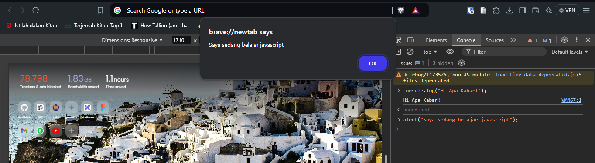<br>

Apa yang dapat disimpulkan setelah mencoba console Javascript? <br>
**Jawab:** Dengan menggunakan console Javascript, dapat menampilkan informasi pada konsol browser.

### **Praktikum 2 : Membuat Program Javascript Pertama**

`hello_world.html`

```html
<!DOCTYPE html>
<html>
  <head>
    <title>Hello World Javascript</title>
  </head>
  <body>
    <script>
      console.log("Saya belajar Javascript");
      document.write("Hello World!");
    </script>
  </body>
</html>
```

### Hasil Percobaan

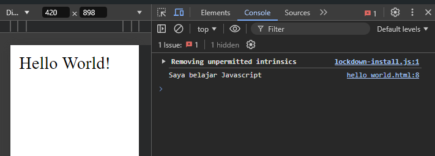<br>

**Penjelasan:** Kode yang ada didalam `<script>` menampilkan teks di konsol browser maupun di halaman browser.<br>

Tadi kita menuliskan perintah : <br>
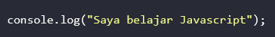<br>
Menurut Anda, mengapa perintah tersebut tidak ditampilkan? <br>

**Jawab:** Perintah tersebut tidak ditampilkan karena itu adalah kode yang hanya bisa menampilkan output di konsol browser..

### **Praktikum 3 : Cara Menulis Kode Javascript di HTML**

**1. Penulisan Kode Javascript dengan Embed**<br>
`hello_world.html`

```html
<!DOCTYPE html>
<html>
  <head>
    <title>Hello World Javascript</title>
    <script>
      console.log("Hello JS dari Head");
    </script>
  </head>
  <body>
    <p>Tutorial Javascript untuk pemula</p>
    <script>
      console.log("Saya belajar Javascript");
      document.write("Hello World!");
    </script>
  </body>
</html>
```

### Hasil Percobaan

<br>

Menurut Anda manakah yang lebih baik, dituliskan didalam tag `<head>` atau `<body>`?<br>
**Jawab:** Menurut saya script js sebaiknya ditempatkan tag `<body>` karena performanya lebih baik dan lebih cepat pemuatan halamannya.<br>

**2. Penulisan Kode Javascript Inline**<br>
`hello_world.html`

```html
<!DOCTYPE html>
<html>
  <head>
    <title>Hello World Javascript</title>
    <script>
      console.log("Hello JS dari Head");
    </script>
  </head>
  <body>
    <p>Tutorial Javascript untuk pemula</p>
    <a href="#" onclick="alert('Yey!')">Click Me!</a>
    <a href="javascript:alert('Yey!')">Click Me!</a>
    <script>
      console.log("Saya belajar Javascript");
      document.write("Hello World!");
    </script>
  </body>
</html>
```

### Hasil Percobaan

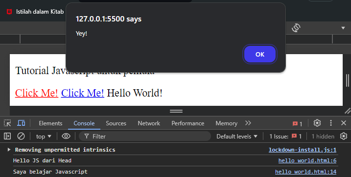<br>

Apa yang membedakan dari kedua kode program tersebut? <br>
**Jawab:** Perbedaannya terdapat pada penulisannya saja dimana link yang pertama menggunakan event handler `onClick` dan link kedua menggunakan `javascript:alert('Yey!')` yang mana cara ini kurang disarankan karena membingungkan.<br>

**3. Penulisan Kode Javascript Inline**<br>
`kode-program.js`

```js
alert("Hello, ini adalah program js eksternal!");
```

`index.html`

```html
<!DOCTYPE html>
<html lang="en">
  <head>
    <title>Belajar Javascript dari nol</title>
  </head>
  <body>
    <p>Tutorial Javascript untuk pemula</p>
    <script src="kode-program.js"></script>
  </body>
</html>
```

### Hasil Percobaan

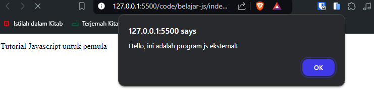<br>
**Penjelasan:** Kode program js yang ada didalam `kode-program.js` akan dieksekusi saat halaman dibuka.<br>

Apa yang akan terjadi jika file javascript berada di folder yang berbeda?<br>
**Jawab:** Jika file javascript berada di folder yang berbeda maka tidak akan terjadi apapun karena file jsnya tidak terakses.<br>

### **Praktikum 4: Jendela Dialog**

`alert_javascript.html`

```html
<html>
  <head>
    <script type="text/javascript">
      function message() {
        alert("This alert box was called with the onload event");
      }
    </script>
  </head>
  <body onload="message()"></body>
</html>
```

### Hasil Percobaan

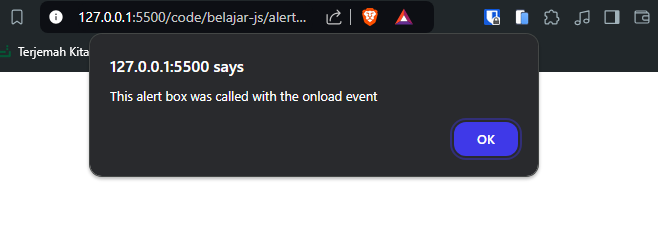<br>
**Penjelasan:** Event `onload` berguna untuk mengeksekusi kode javascript ketika halaman pertama kali dimuat. Event tersebut menerima value berupa function `message()`.<br>

`confirm_javascript.html`

```html
<!DOCTYPE html>
<html lang="en">
  <head>
    <title>Dialog Confirm</title>
  </head>
  <body>
    <script>
      var yakin = confirm("Apakah kamu yakin akan mengunjungi polinema?");

      if (yakin) {
        window.location.href = "https://www.polinema.ac.id";
      } else {
        document.write("Baiklah, tetap disini saja ya :)");
      }
    </script>
  </body>
</html>
```

### Hasil Percobaan

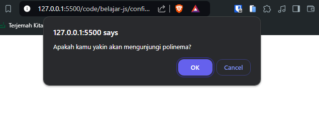<br>
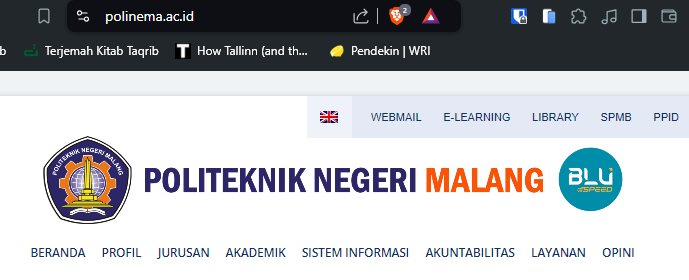<br>
**Penjelasan:** Kode di atas menampilkan dialog konfirmasi yang akan menggunakan fungsi `confirm()` yang menerima value berupa string. Jika user yakin akan mengunjungi polinema maka akan melakukan halaman yang diberikan pada `window.location.href`. Jika tidak akan mengunjungi maka akan menampilkan string lain.<br>

`prompt_javascript.html`

```html
<!DOCTYPE html>
<html lang="en">
  <head>
    <title>Dialog Prompt</title>
  </head>
  <body>
    <script>
      var nama = prompt("Siapa nama kamu");
      document.write("<p>Hello " + nama + "</p>");
    </script>
  </body>
</html>
```

### Hasil Percobaan

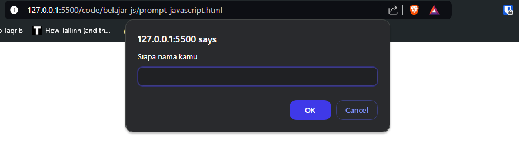<br>
<br>

**Penjelasan:** Kode di atas menampilkan dialog prompt yang akan menggunakan fungsi `prompt()` yang menerima value berupa string lalu menampilkan string yang diberikan pada halaman web.

### **Praktikum 5: Variabel**

`variabel_javascript.html`

```html
<!DOCTYPE html>
<html lang="en">
  <head>
    <title>Belajar variabel dalam Javascript</title>
    <script>
      var name = "Javascript";
      var visitorCount = 50322;
      var isActive = true;

      alert("Selamat datang di " + name);

      document.write("Nama Situs: " + name + "<br>");
      document.write("Jumlah Pengunjung: " + visitorCount + "<br>");
      document.write("Status Aktif: " + isActive + "<br>");
    </script>
  </head>
  <body></body>
</html>
```

### Hasil Percobaan

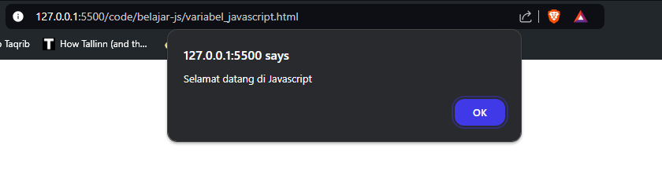<br>
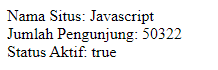<br>

**Penjelasan:** Kode diatas adalah cara mendeklarasi variabel di javascript, lalu menampilkan variabel tersebut di halaman web.

### **Praktikum 6 : FUNGSI**

`fungsi_javascript.html`

```html
<!DOCTYPE html>
<html lang="en">
  <head>
    <script>
      var sayHello = () => alert("Hello World!");
    </script>
  </head>
  <body>
    <a href="#" onclick="sayHello()">Klik Aku</a>
  </body>
</html>
```

### Hasil Percobaan

<br>
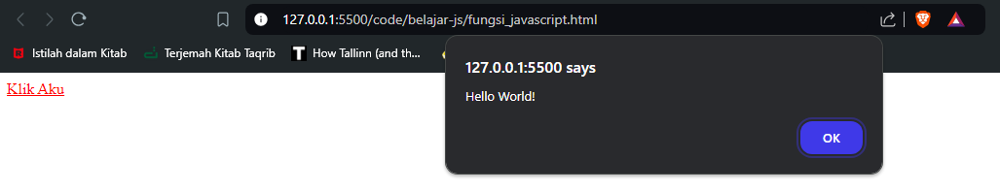<br>

**Penjelasan:** Variabel juga bisa berisi sebuah fungsi.<br>

`fungsi_berparameter_javascript.html`

```html
<html>
  <head>
    <script type="text/javascript">
      function total(numberA, numberB) {
        return numberA + numberB;
      }
    </script>
  </head>
  <body>
    <script type="text/javascript">
      document.write(total(2, 3));
    </script>
    |
  </body>
</html>
```

### Hasil Percobaan

<br>

**Penjelasan:** Fungsi `total` menerima 2 parameter yaitu `numberA` dan `numberB` lalu hasilnya ditampilkan di halaman web.

### **Praktikum Bagian 7 : Tipe Data**

`tipedata_javascript.html`

```html
<!DOCTYPE html>
<body>
  <h2>Javascript Data Type</h2>

  <p>Contoh Javascript Data Types:</p>

  <p id="demo"></p>

  <script>
    var x;
    x=5;
    x="John";

    document.getElementById("demo").innerHTML=x;
  </script>
</body>
</html>
```

### Hasil Percobaan

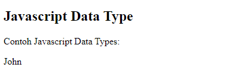<br>

**Penjelasan:** Kode script diatas menampilkan `John` karena variabel `x` terakhir diinisialisasi dengan nilai `John`. Lalu variabel tersebut dimasukkan ke tag html `p` dengan id `demo` dengan menggunakan fungsi `getElementById()` yang berguna untuk memanipulasi elemen html dengan `id` yang ditentukan.<br>

`string_javascript.html`

```html
<!DOCTYPE html>
<html>
  <body>
    <h2>Javascript String</h2>

    <p>Membuat Javascript String</p>

    <p id="demo"></p>

    <script>
      var answer1 = "It's alright";
      var answer2 = "He is called 'Dilan'";
      var answer3 = 'He is called "Dilan"';

      document.getElementById("demo").innerHTML =
        answer1 + "<br>" + answer2 + "<br>" + answer3;
    </script>
  </body>
</html>
```

### Hasil Percobaan

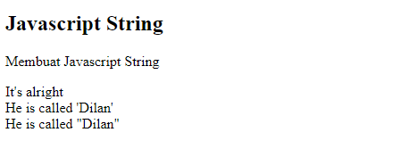<br>
**Penjelasan:** Kode diatas memnunjukkan cara untuk menggabungkan value dari beberapa variabel.<br>

`boolean_javascript.html`

```html
<!DOCTYPE html>
<html lang="en">
  <body>
    <h2>Javascript Boolean</h2>

    <p>Boolean hanya memiliki nilai `true` dan `false`.</p>

    <p id="demo"></p>

    <script>
      var x = 5;
      var y = 5;
      var z = 6;

      document.getElementById("demo").innerHTML = (x == y) + "<br>" + (x == z);
    </script>
  </body>
</html>
```

### Hasil Percobaan

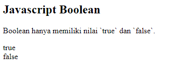<br>
**Penjelasan:** Kode diatas adalah contoh penggunaan boolean dengan cara membandingkan 2 angka.<br>

`array_javascript.html`

```html
<!DOCTYPE html>
<html lang="en">
  <body>
    <h2>Javascript Arrays</h2>

    <p>Array</p>

    <p id="demo"></p>

    <script>
      var cars = ["Satu", "Dua", "Tiga"];

      document.getElementById("demo").innerHTML = cars[0];
    </script>
  </body>
</html>
```

### Hasil Percobaan

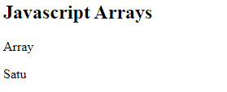<br>
**Penjelasan:** Kode diatas adalah contoh penggunaan array yang menampilkan nilai dari array dengan index 0.

### **Praktikum Bagian 8: Praktikum 8: Operator**

`operator_javascript.html`

```html
<!DOCTYPE html>
<html lang="en">
  <body>
    <h2>Javascript Operator</h2>

    <p>x=5, y=2, menghitung z=x+y, dan tampil z:</p>
    <p id="demo"></p>

    <script>
      var x = 5;
      var y = 2;
      var z = x + y;

      document.getElementById("demo").innerHTML = z;
    </script>
  </body>
</html>
```

### Hasil Percobaan

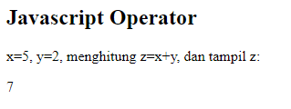<br>
**Penjelasan:** Kode script diatas menunjukkan cara melakukan penjumlahan.

### **Praktikum Bagian 9 : Percabangan**

`index.html`

```html
<!DOCTYPE html>
<html lang="en">
  <head>
    <title>Percabangan if</title>
  </head>
  <body>
    <script>
      var totalBelanja = prompt("Total belanja?", 0);

      if (totalBelanja > 30000) {
        document.write("<h2>Selamat Anda dapat hadiah</h2>");
      }

      document.write("<p>Terimakasih sudah berbelanja di toko kami</p>");
    </script>
  </body>
</html>
```

### Hasil Percobaan

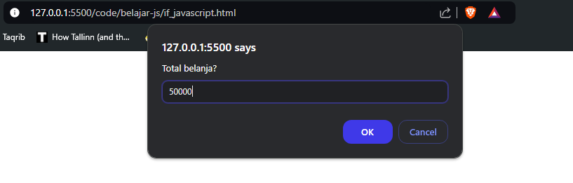<br>
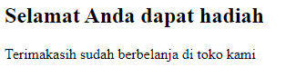<br>
**Penjelasan:** Kode diatas menunjukkan cara menggunakan if-else dengan script js.<br>

`ifelse_javascript.html`

```html
<!DOCTYPE html>
<html lang="en">
  <head>
    <title>Percabangan if-else</title>
  </head>
  <body>
    <script>
      var password = prompt("Password:");

      if (password == "teh") {
        document.write("<h2>Selamat datang !</h2>");
      } else {
        document.write("<p>Password salah, coba lagi!</p>");
      }
      document.write("<p>Terimakasih sudah menggunakan aplikasi ini!</p>");
    </script>
  </body>
</html>
```

### Hasil Percobaan

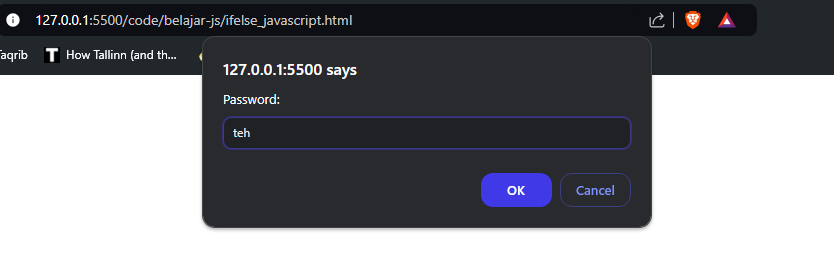<br>
<br>
**Penjelasan:** Kode diatas menunjukkan cara menggunakan if-else dengan script js dengan contoh menggunakan inputan password.<br>

`switchcase_javascript.html`

```html
<!DOCTYPE html>
<html lang="en">
  <head>
    <title>Percabangan switch-case</title>
  </head>
  <body>
    <script>
      var jawab = prompt(
        "Kamu beruntung! Silakan pilih hadiahmu dengan memasukkan angka 1 sampi 5"
      );
      var hadiah = "";

      switch (jawab) {
        case "1":
          hadiah = "Tisu";
          break;
        case "2":
          hadiah = "1 kotak kopi";
          break;
        case "3":
          hadiah = "Sticker";
          break;
        case "4":
          hadiah = "Minyak Goreng";
          break;
        case "5":
          hadiah = "Uang Rp 50.000";
          break;
        default:
          document.write("<p>Opps! anda salah pilih</p>");
      }

      if (hadiah === "") {
        document.write("<p>Kamu gagal mendapat hadiah</p>");
      } else {
        document.write("<h2>Selamat kamu mendapatkan " + hadiah + "</h2>");
      }
    </script>
  </body>
</html>
```

### Hasil Percobaan

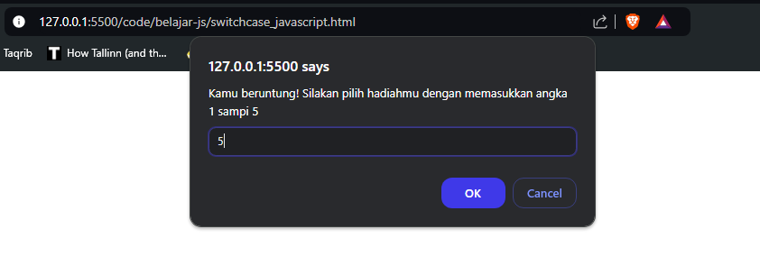<br>
<br>
**Penjelasan:** Kode diatas menunjukkan cara menggunakan switch-case dengan script js dengan contoh pemilihan sebuah hadiah<br>

`nestedif_javascript.html`

```html
<!DOCTYPE html>
<html lang="en">
  <head>
    <title>Percabangan Ternary</title>
  </head>
  <body>
    <script>
      var username = prompt("Username:");
      var password = prompt("Password:");

      if (username == "mahasiswa") {
        if (password == "kopi") {
          document.write("<h2>Selamat Datang</h2>");
        } else {
          document.write("<p>Password salah, coba lagi!</p>");
        }
      } else {
        document.write("<p>Anda tidak terdaftar!</p>");
      }
    </script>
  </body>
</html>
```

### Hasil Percobaan

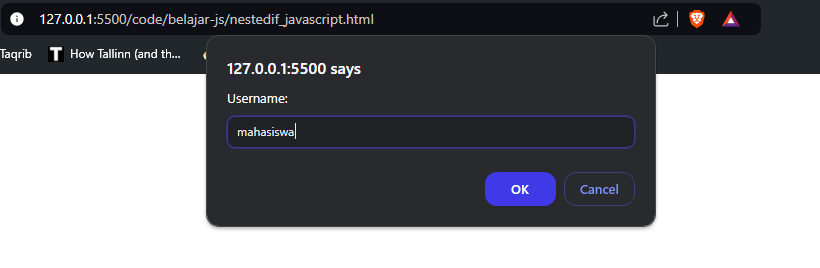<br>
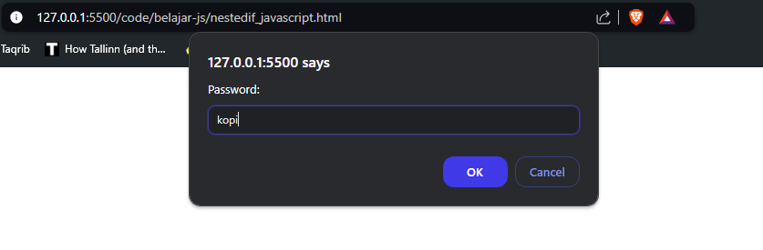<br>
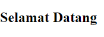<br>
**Penjelasan:** Kode diatas menunjukkan cara menggunakan nested if-else dengan script js dengan contoh menggunakan inputan username dan password.<br>

### **Praktikum Bagian 10 : Perulangan**

`for_javascript.html`

```html
<!DOCTYPE html>
<html lang="en">
  <body>
    <h2>Javascript Loops</h2>

    <p id="demo"></p>

    <script>
      var text = "";
      var i;

      for (i = 0; i < 5; i++) {
        text += "The number is " + i + "<br>";
      }

      document.getElementById("demo").innerHTML = text;
    </script>
  </body>
</html>
```

### Hasil Percobaan

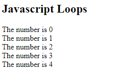<br>

**Penjelasan:** Kode diatas menunjukkan cara menggunakan for-loop dengan script js yang menampilkan teks berisi angka yang urut.<br>

`while_javascript.html`

```html
<!DOCTYPE html>
<html lang="en">
  <body>
    <h2>Javascript While</h2>

    <p id="demo"></p>

    <script>
      var text = "";
      var i = 0;

      while (i < 10) {
        text += "The number is " + i;
        i++;
      }

      document.getElementById("demo").innerHTML = text;
    </script>
  </body>
</html>
```

### Hasil Percobaan

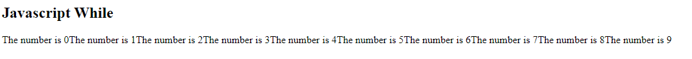<br>
**Penjelasan:** Kode diatas menunjukkan cara menggunakan while-loop dengan script js yang menampilkan teks berisi angka yang urut.<br>

`do...while_javascript.html`

```html
<!DOCTYPE html>
<html lang="en">
  <body>
    <h2>Javascript do...while</h2>

    <p id="demo"></p>

    <script>
      var text = "";
      var i = 0;

      do {
        text += "<br>The number is " + i;
        i++;
      } while (i < 10);

      document.getElementById("demo").innerHTML = text;
    </script>
  </body>
</html>
```

### Hasil Percobaan

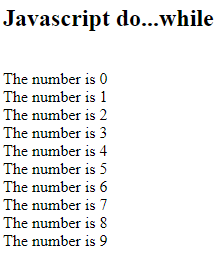<br>
**Penjelasan:** Kode diatas menunjukkan cara menggunakan do-while loop dengan script js yang menampilkan teks berisi angka yang urut.<br>
